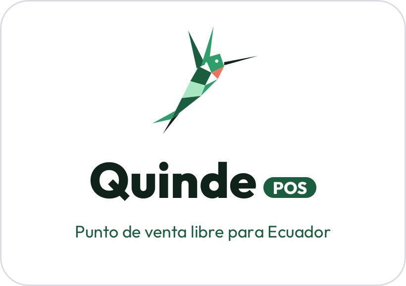
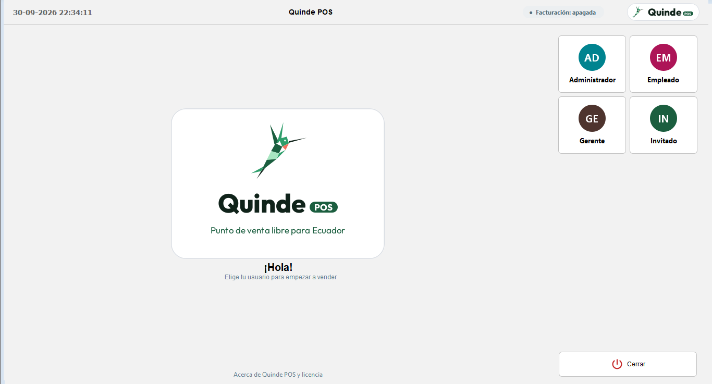
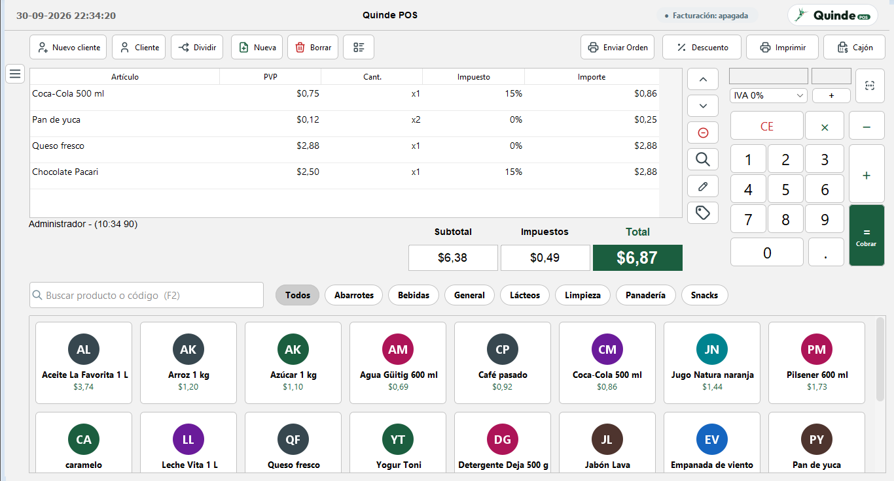
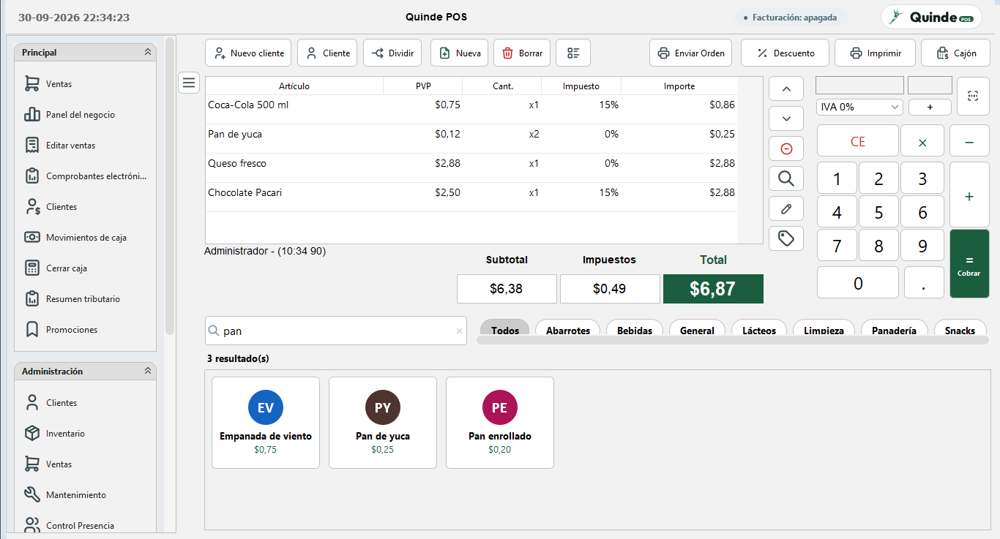
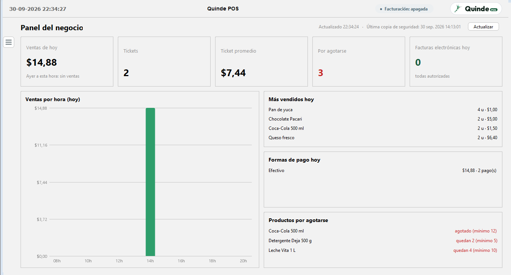
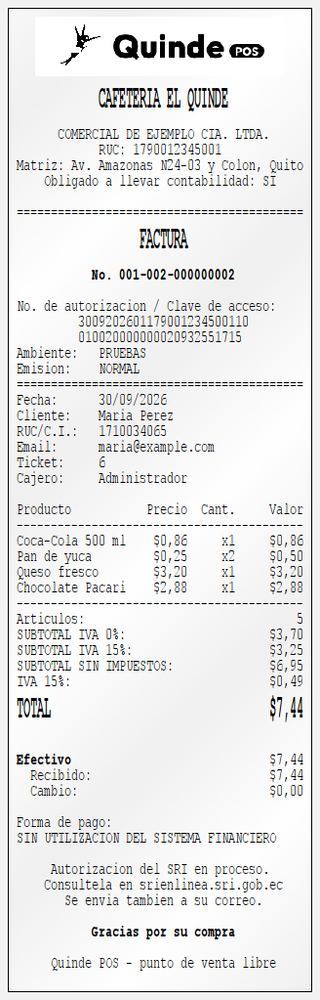
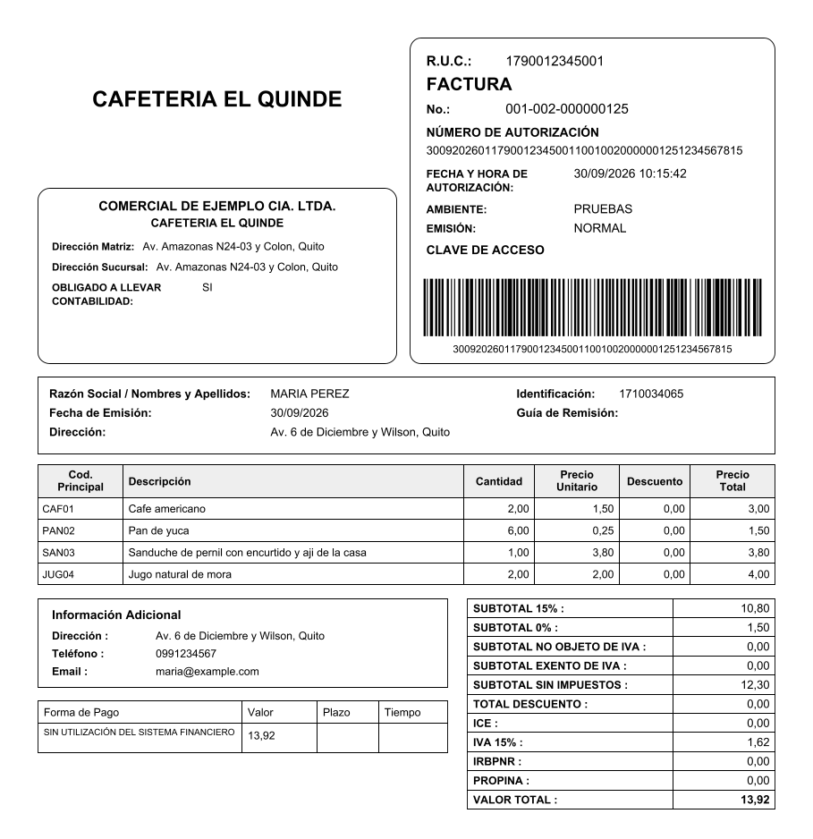
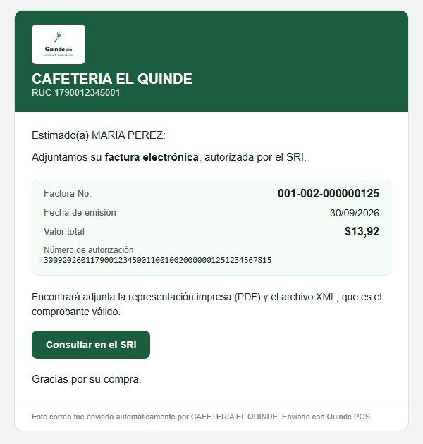
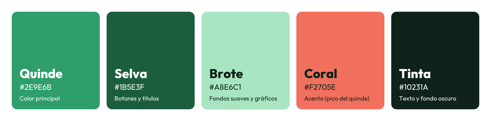
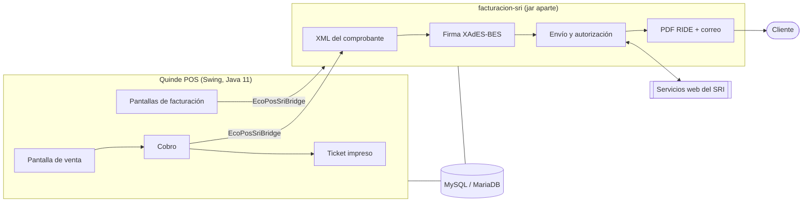

<p align="center"></p>

<h1 align="center">🐦 Quinde POS</h1>

<p align="center"><b>Punto de venta libre para Ecuador</b> — con facturación electrónica del SRI incluida.</p>

<p align="center">🌐 <a href="https://quindepos.cyrshop.app/"><b>quindepos.cyrshop.app</b></a></p>

<p align="center">


</p>

**Quinde POS** (antes EcoPos) es un sistema de punto de venta de escritorio, **libre y gratuito**, para tiendas,
cafeterías, restaurantes y negocios de retail del Ecuador. Funciona en Windows, Linux y macOS, se usa con pantalla
táctil o con mouse y teclado, y **emite facturas electrónicas ante el SRI** sin programas aparte: el módulo
[facturacion-sri/](facturacion-sri/) vive en este mismo repositorio.

*Quinde* es como se le dice al colibrí en el Ecuador: pequeño, rápido y de aquí.

Licenciado bajo [GNU GPL v3](https://www.gnu.org/licenses/gpl-3.0.html).

## 📸 Capturas

| Inicio de sesión | Pantalla de venta |
|---|---|
|  |  |
| **Menú y búsqueda de productos** | **Panel del negocio** |
|  |  |

| Ticket impreso con la factura | Factura en PDF (RIDE) que recibe el cliente | Correo al cliente |
|---|---|---|
|  |  |  |

> Las capturas usan un negocio y clientes **de ejemplo** (Cafetería El Quinde, María Pérez); no son datos reales.

## ✨ Características

**Venta**
- 🖱️ Pantalla de venta táctil y moderna: buscador de productos (F2), categorías en pestañas, tarjetas con foto o iniciales, total destacado y cobro con **F12**
- 💵 Cobro en dólares: billetes y monedas rápidos, botón **Exacto**, cambio en grande, pago dividido, Transferencia y DeUna
- 🏷️ Promociones automáticas: 2x1, 3x2, % por producto o categoría y *happy hour*
- 👤 Historial del cliente al atenderlo (compras, gasto total, última visita)

**Ecuador y SRI**
- 🧾 **Facturación electrónica integrada**: factura y nota de crédito (total o parcial), firma XAdES-BES, envío y autorización del SRI, reintentos automáticos
- 🇪🇨 "Consumidor final / Factura con datos" con validación de cédula y RUC
- 🖨️ El ticket impreso **es la factura**: número, clave de acceso, cliente, subtotales por tarifa de IVA y forma de pago con el texto del SRI
- 📄 PDF (RIDE) con el formato del SRI y el logo del negocio, enviado por correo al cliente
- 📊 Resumen tributario mensual por tarifa de IVA (base del formulario 104), exportable a CSV
- 💡 Los errores del SRI se explican en palabras simples, con qué hacer

**Negocio y caja**
- 📈 Panel del negocio: ventas de hoy contra ayer, ticket promedio, ventas por hora, más vendidos y stock bajo
- 🔐 Autorización de supervisor (con registro) para borrar, descontar, devolver o abrir el cajón
- 🧮 Arqueo de caja con cierre ciego por billetes y monedas
- 💾 Copia de seguridad automática diaria de la base de datos
- 👥 Roles: Administrador, Gerente, Empleado e Invitado, con permisos

**Técnico**
- 🎨 Tema **Quinde Claro / Oscuro** con íconos vectoriales, nítido en pantallas con escala (125 %, 150 %…)
- 🗄️ MySQL/MariaDB (recomendado), PostgreSQL, Oracle, Derby y HSQLDB
- 📠 Lector de código de barras, cajón de dinero, impresoras térmicas y visor de cliente (JavaPOS / ESC/POS)
- 🔄 Las bases de datos existentes se actualizan solas al abrir una versión nueva

## 🎨 Identidad visual

### Logo

| Logo principal | Ícono de la app | Barra superior | Ticket impreso (blanco y negro) |
|---|---|---|---|
|  |  |  |  |

El quinde es un colibrí geométrico hecho de facetas (polígonos), con el pico en coral. El original vectorial está en
[branding/quinde-icono.svg](branding/quinde-icono.svg); todas las versiones en PNG e ICO (incluidas las de 2x y 3x para
pantallas con escala y la pantalla de carga) se generan con [branding/GenerarMarca.java](branding/GenerarMarca.java).

### Paleta "Selva"



| Nombre | Hex | Uso |
|---|---|---|
| Quinde | `#2E9E6B` | Color principal: estados "al día", gráficos, acentos |
| Selva | `#1B5E3F` | Botones principales (Cobrar), títulos, total |
| Brote | `#A8E6C1` | Fondos suaves, barras secundarias de gráficos |
| Coral | `#F2705E` | Acento puntual (el pico del quinde); nunca para errores |
| Tinta | `#10231A` | Texto y fondo del tema oscuro / pantalla de carga |

### Tipografía e íconos

- **Tipografía de la marca:** [Outfit](https://fonts.google.com/specimen/Outfit) (ExtraBold para "Quinde", Regular para textos), licencia SIL OFL 1.1, incluida en [branding/fuentes/](branding/fuentes/).
- **Íconos de la app:** [Tabler Icons](https://tabler.io/icons) (licencia MIT), en SVG, en `src-pos/com/openbravo/images/svg/`.

## 🧰 Tecnologías

**Quinde POS (la aplicación)**

| Tecnología | Versión | Para qué se usa |
|---|---|---|
|  Java (Swing) | 11 | Aplicación de escritorio |
| [FlatLaf](https://www.formdev.com/flatlaf/) (+ extras, SwingX) | 3.5.4 | Tema moderno Quinde Claro / Oscuro |
| [JSVG](https://github.com/weisJ/jsvg) | 1.4.0 | Dibujo de los íconos SVG |
| [Apache Velocity](https://velocity.apache.org/) | 1.7 | Plantillas del ticket impreso |
| [JasperReports](https://community.jaspersoft.com/) | 4.5.1 | Reportes |
| [BeanShell](https://beanshell.github.io/) | 2.1b5 | Scripts configurables (botones, eventos de la venta) |
| JDBC: MySQL Connector/J, PostgreSQL, Derby, HSQLDB | 5.1.49 / 9.2 / … | Bases de datos |
| [JavaPOS](https://github.com/JavaPOSWorkingGroup) y RXTX | 1.13 | Periféricos: impresora, cajón, lector, visor |
| JUnit | 4.8.2 | Pruebas |

**Módulo de facturación electrónica** ([facturacion-sri/](facturacion-sri/))

| Tecnología | Versión | Para qué se usa |
|---|---|---|
| Java | 11 | Módulo independiente (jar propio) |
| [Apache CXF](https://cxf.apache.org/) (JAX-WS) | 3.6.4 | Servicios web SOAP del SRI (recepción y autorización) |
| JAXB | 2.3 / 4.0 | XML de factura y nota de crédito generado desde los XSD oficiales del SRI |
| [xades4j](https://github.com/luisgoncalves/xades4j) | 2.4.0 | Firma electrónica XAdES-BES con el certificado .p12 |
| [Apache PDFBox](https://pdfbox.apache.org/) | 2.0.31 | PDF de la factura (RIDE) |
| [ZXing](https://github.com/zxing/zxing) | 3.5.3 | Código de barras de la clave de acceso |
| [Jakarta Mail](https://eclipse-ee4j.github.io/mail/) | 2.0.1 | Envío del PDF y el XML al cliente |
| MySQL Connector/J | 8.0.33 | Base de datos (la misma de Quinde POS) |
| SLF4J + Logback | 2.0 / 1.5 | Registro de eventos |
| JUnit | 5.10 | Pruebas (42) |

## 🛠️ Herramientas

| Herramienta | Uso | Enlace |
|---|---|---|
|  | Ejecutar y compilar | [Adoptium Temurin 11](https://adoptium.net/temurin/releases/?version=11) |
|  | Base de datos (recomendada) | [XAMPP](https://www.apachefriends.org/) · [MariaDB](https://mariadb.org/) |
|  | Compilar Quinde POS (`build_working.xml`) | [ant.apache.org](https://ant.apache.org/) |
|  | Compilar el módulo de facturación | [maven.apache.org](https://maven.apache.org/) |
|  | Control de versiones | [git-scm.com](https://git-scm.com/) |
|  | Firma electrónica (.p12) y consulta de comprobantes | [srienlinea.sri.gob.ec](https://srienlinea.sri.gob.ec/) |

Compatible con Windows, Linux o macOS.

## 🏗️ Arquitectura



- El módulo de facturación es un **jar aparte** que Quinde POS carga al arrancar, con sus propias librerías aisladas (así no chocan con las del POS). Si no está instalado, el POS funciona igual, sin facturación.
- Los dos se hablan por una sola interfaz, `EcoPosSriBridge`, con **número de versión**: si el módulo instalado es de otra versión, el POS lo avisa en vez de fallar.
- Al cobrar, el número de factura y la clave de acceso se reservan **antes de imprimir**, así el ticket siempre coincide con lo que se envía al SRI. El envío sigue en segundo plano y el cajero ve el resultado en un aviso.

## 📁 Estructura del proyecto

| Ruta | Contenido |
|---|---|
| `src-pos/` | Código fuente principal de la aplicación (`com.openbravo.pos.*`) |
| `src-beans/` | Componentes Swing reutilizables e imágenes |
| `src-data/` | Capa de acceso a datos (`com.openbravo.data.*`) |
| `facturacion-sri/` | Módulo de facturación electrónica SRI (Maven, Java 11): factura, nota de crédito, firma, RIDE y correo — ver su [README](facturacion-sri/README.md) y la [guía de instalación](facturacion-sri/INSTALAR.md) |
| `branding/` | Logo (SVG, PNG, ICO), paleta, tipografía y los generadores de las imágenes de la marca |
| `herramientas/` | Scripts que generan las plantillas del ticket, del cierre de caja y el estilo de los reportes |
| `docs/` | Página del proyecto (GitHub Pages: `docs/index.html`) y las capturas de este README |
| `lib/` | Dependencias de terceros (`.jar`) incluidas en el repo |
| `locales/` | Traducciones de la interfaz |
| `reports/` | Plantillas JasperReports |
| `build_working.xml` | Script de compilación Ant (Quinde POS y, con `todo`, también el módulo) |

> 💡 Los paquetes Java internos usan el namespace `com.openbravo.*` y algunos nombres técnicos siguen siendo `ecopos`
> (archivo `ecopos.properties`, base de datos `ecopos`, `ecopos.jar`): así las instalaciones existentes se actualizan sin romperse.

## 🔨 Compilación

El `build.xml` original (NetBeans + Ant) depende de metadatos `nbproject/` que no están en este repositorio. En su lugar, usa **`build_working.xml`**, un build Ant autocontenido que sí compila y empaqueta el proyecto de punta a punta:

```sh
# Instala Apache Ant si no lo tienes (https://ant.apache.org/bindownload.cgi)
ant -f build_working.xml jar
```

Esto genera `build/jar/ecopos.jar`. Para compilar **también el módulo de facturación electrónica** (necesita
[Maven](https://maven.apache.org/) y deja el jar listo en `sri-conector/`):

```sh
ant -f build_working.xml todo     # Quinde POS + facturación electrónica
ant -f build_working.xml sri      # solo el módulo de facturación (con sus tests)
```

> 💡 La interfaz entre los dos (`EcoPosSriBridge`) es un único archivo dentro de `facturacion-sri/`; Quinde POS la
> compila desde ahí. Si cambias esa interfaz, sube `VERSION_CONTRATO`: al arrancar, Quinde POS compara su versión con
> la del módulo y, si no coinciden, lo avisa en la barra superior ("Facturación: actualizar módulo").

Si no tienes Ant a mano, el equivalente manual con solo el JDK es:

```sh
# Desde la raíz del proyecto
mkdir -p build/classes

# Compilar los tres módulos fuente juntos (se referencian entre sí)
find src-beans src-data src-pos -name "*.java" > sources.txt
javac -encoding UTF-8 -d build/classes -cp "lib/*" \
  -sourcepath "src-beans;src-data;src-pos;facturacion-sri/src/main/java" @sources.txt

# Copiar recursos no-Java (íconos, .properties, etc.) al directorio de clases
for d in src-beans src-data src-pos; do
  (cd "$d" && find . -type f ! -name "*.java" ! -name "*.form" -print0 \
    | tar --null -T - -cf -) | (cd build/classes && tar -xf -)
done

# Empaquetar el jar ejecutable
mkdir -p build/jar
printf 'Main-Class: com.openbravo.pos.forms.StartPOS\n' > manifest.txt
jar cfm build/jar/ecopos.jar manifest.txt -C build/classes .
```

> 💡 `src-beans`, `src-data` y `src-pos` se referencian entre sí (por ejemplo, componentes en `src-beans` usan `com.openbravo.pos.forms.AppConfig`), así que cualquier compilación necesita ver los tres directorios en el `sourcepath`, y cualquiera de los tres módulos puede terminar necesitando `lib/*.jar` (p. ej. `RXTXcomm.jar` para el soporte de puerto serie) — por eso las tres reglas de compilación en `build_working.xml` comparten el mismo classpath.

## ▶️ Ejecución

Ejecuta el jar con las librerías necesarias en el classpath (ver `start.bat` / `start.sh` para la lista completa — JasperReports, POI, iText, Substance L&F, el driver JDBC de tu base de datos, etc.):

```sh
java -cp "build/jar/ecopos.jar;lib/jasperreports-4.5.1.jar;lib/jcommon-1.0.15.jar;lib/jfreechart-1.0.12.jar;lib/swing-layout-1.0.4.jar;lib/AbsoluteLayout.jar;lib/trident.jar;lib/substance.jar;lib/substance-swingx.jar;lib/substance-extras.jar;lib/swingx-all-1.6.4.jar;lib/flatlaf-3.5.4.jar;lib/flatlaf-extras-3.5.4.jar;lib/flatlaf-swingx-3.5.4.jar;lib/jsvg-1.4.0.jar;lib/mysql-connector-java-5.1.49.jar;locales/;reports/" \
  -Ddirname.path="./" com.openbravo.pos.forms.StartPOS
```

O más simple, usa el script ya armado con el classpath completo (todos los idiomas incluidos):

```sh
./start.sh        # Linux/macOS
start.bat         # Windows
```

Al primer arranque, Quinde POS escribe su configuración en `~/ecopos.properties`. Por defecto apunta a una base de datos Derby embebida; edita ese archivo (o usa la pantalla **Configuración → Base de datos** dentro de la app) para apuntar a MySQL/MariaDB, PostgreSQL, etc. Si apunta a un esquema vacío, Quinde POS crea automáticamente todas las tablas y datos iniciales (roles, categoría/producto/impuestos por defecto) en el siguiente arranque.

> 💡 `ResourceBundle` solo busca archivos de traducción en la raíz del classpath, no en subcarpetas — por eso `start.bat`/`start.sh` agregan explícitamente `locales/<Idioma>/locales/` y `locales/<Idioma>/reports/` de los 15 idiomas incluidos. Si armas tu propio classpath a mano (como el comando de arriba), sin esas rutas la app cae siempre a inglés sin importar `user.language`.

## ✅ Tests

Tests JUnit para las clases de lógica pura (sin GUI ni base de datos): `AltEncrypter` (cifrado ida y vuelta), `LuhnAlgorithm` (validación de tarjetas), `StringUtils` y `ValidadorIdentificacion` (cédula, RUC de persona natural, sociedad y entidad pública, consumidor final y pasaporte).

```sh
ant -f build_working.xml test
```

El módulo de facturación tiene sus propias **42 pruebas** (XML validado contra el XSD oficial del SRI, clave de acceso,
cálculo de notas de crédito parciales, PDF, correo, mensajes de error, etc.), que corren al compilarlo:

```sh
ant -f build_working.xml sri      # o, dentro de facturacion-sri/:  mvn test
```

## 🗄️ Datos por defecto

Una base de datos nueva viene con:

- 👤 Cuatro roles: Administrador, Gerente, Empleado, Invitado
- 🏷️ Una categoría por defecto (`General`) y un producto interno (`***`, usado para líneas sin producto)
- 💵 Dos tarifas de IVA de Ecuador: `IVA 0%` e `IVA 15%`

Renómbralos según tu negocio — **no los elimines**, otros registros pueden depender de sus IDs.

> ⚠️ Si tu base se creó con una versión anterior de EcoPos, puede tener un impuesto "Tax Standard" al **10%**. Esa tarifa no existe en Ecuador y el SRI rechaza las facturas que la usan: cámbiala a 15% en **Administración → Impuestos**.

## 🆕 Mejoras recientes

Cada fase se documenta aquí al terminarla. Lo que falta está en **Pendientes / Hoja de ruta**, más abajo.

### Fase T — Recursos con el aviso de licencia de Quinde POS (2026-10-01)
- Los 45 recursos (plantillas de impresión, scripts, menú) y los roles ya no empiezan con el texto en inglés del programa original: ahora llevan un **aviso corto en español de Quinde POS**. Se conserva lo que la licencia GPL exige: la línea de copyright (incluido el original, 2009-2014) y que el archivo es software libre bajo la GPL v3, sin garantía.
- El resto de cada recurso no cambia. Las bases existentes se actualizan solas al abrir la app (también lo que el negocio haya personalizado, porque solo se toca ese comentario).
- Se quitó un script de ejemplo sin uso que tenía una conexión a la base escrita a mano.

### Fase S — Scripts de la venta modernos y corregidos (2026-09-30)
- **Aviso de cambio** (al terminar una venta en efectivo): ahora es un recuadro con el cambio en grande y en verde, más lo recibido y el total. **Suma todos los pagos en efectivo** (también en un pago dividido), **no aparece si el pago fue exacto**, se cierra solo a los 8 segundos o con un toque, y **no le quita el foco a la venta siguiente**, así el lector de códigos sigue funcionando. Antes usaba Arial fija, salía en cada venta aunque no hubiera cambio, solo miraba el primer pago y se abría desde un hilo aparte, lo que podía dejarlo detrás o trabar la pantalla.
- **Descuentos (toda la venta y por línea)**: si no escribiste el porcentaje, lo pregunta (antes solo hacía "bip"). Se calcula sobre el precio de lista, así que **aplicarlo dos veces no lo acumula** y 0 % lo quita. **Convive con las promociones** (2x1 y luego 10 %, sin perderse al recalcular). Ya **no cambia el nombre del producto** ("Café - 10%"), que es el que va en la factura del SRI, y no borra las notas de la línea.
- **Control de stock** (opcional): antes abría una conexión nueva a la base por cada producto y nunca la cerraba; ahora usa la de la app, compara bien los productos y dice cuánto hay disponible. No avisa por los servicios.
- **Aviso antes de cobrar con pedidos sin enviar a cocina** (opcional): estaba roto (usaba una variable inexistente y bloqueaba siempre el cobro); corregido.
- Nota de la línea, mesero y envío a cocina con ventanas que salen sobre la app y con su tema. Se quitó un comentario de los viejos botones "Facturar SRI".
- Las bases existentes reciben los scripts nuevos solo si tenían una versión de fábrica (se reconoce por su huella), así nada personalizado se pisa. Nuevas pruebas automáticas del descuento con promociones.

### Fase R — Correo con diseño (2026-09-30)
- El correo con la factura o la nota de crédito ahora tiene **diseño**: encabezado verde con el **logo y el nombre del negocio**, saludo al cliente, un recuadro con número, fecha, total y número de autorización, y un botón **"Consultar en el SRI"**. Se ve bien en el celular.
- Lleva también la versión en **texto plano** para los programas de correo que no muestran diseño, y el PDF y el XML adjuntos como antes.
- El total usa la misma coma decimal que el PDF ($13,92).

### Fase Q — Todos los recursos en español y billetes en dólares (2026-09-30)
- **Abono a cuenta** (cuando un cliente paga su deuda) con el formato nuevo: negocio, cliente con cédula/RUC, monto del abono en grande, **saldo pendiente** y forma de pago.
- **Movimiento de inventario** impreso como "ENTRADA / SALIDA DE INVENTARIO", con fecha, motivo, almacén, productos y líneas para firma de quien entrega y quien recibe.
- **Visor de cliente** en español (bienvenida con "Quinde POS", total, recibido y cambio, "Gracias", "Siguiente cliente").
- Etiqueta de producto en dólares (tenía euros y pesetas); el ticket alternativo y el fiscal traducidos.
- **Mensajes de los botones de la venta en español**: nota de la línea ("Nota para esta línea"), enviar a cocina ("Pedido enviado a cocina" / "No hay nada nuevo para enviar"), mesero, descuento de línea, cargo por servicio y avisos de stock.
- **Billetes y monedas de dólar** para los temas clásicos (antes eran libras esterlinas), dibujados con la tipografía de la marca.
- Las bases existentes se actualizan solas: las plantillas se reemplazan solo si seguían siendo las de fábrica, en los scripts se cambian únicamente las frases y las imágenes solo si eran exactamente las originales.
- Los generadores de plantillas y reportes quedan en [herramientas/](herramientas/) para volver a generarlos cuando haga falta.

### Fase P — Reportes con el estilo de Quinde POS (2026-09-30)
- Los **47 reportes** (ventas, impuestos, pagos, cierres, inventario, clientes…) ahora llevan arriba el **nombre y RUC del negocio** y su **logo** (el de *Facturación electrónica*), títulos y líneas en la paleta Selva en vez del celeste anterior, hora en formato 24 h ("30/09/2026 23:05") y "Quinde POS" en el pie.
- Gráficos **planos con los colores de la marca** (antes en 3D y azules); el gráfico de pastel y el de serie de tiempo ya no fallan (pedían una librería SVG que no venía con la app).
- Formas de pago en español en los reportes ("Efectivo" en vez de "cash") y unas 50 etiquetas que faltaban o seguían en inglés traducidas (costo, precio, subtotal, IVA, secuencia, equipo, ganancia…). Tres reportes que no tenían traducción ahora la tienen.
- **Reportes que no abrían, arreglados**: *Ventas Top 10* (usaba SQL que MariaDB no entiende), *Precios actualizados*, *Rendimiento* y *Registro de caja extendido* (errores de la plantilla original).
- Un reporte **sin datos** ahora muestra su encabezado y totales en cero, en vez de una hoja en blanco que parecía un error.
- Verificado: los 47 compilan y 53 de 56 definiciones de reportes se generan con datos (las 3 restantes son variantes viejas que no están en el menú).

### Fase O — Factura en PDF: páginas, marca de agua de pruebas y pie (2026-09-30)
- **"Página X de Y"** en cada hoja y, en las páginas siguientes, un encabezado corto ("FACTURA No. … (continuación)", emisor y RUC).
- En **ambiente de pruebas**, marca de agua **"SIN VALOR TRIBUTARIO – AMBIENTE DE PRUEBAS"**, para que una factura de prueba nunca se confunda con una real. En producción no aparece.
- Pie con dónde consultar el comprobante (srienlinea.sri.gob.ec). Aplica igual a la nota de crédito.

### Fase N — Cierre de caja, corte parcial y comanda de cocina en español (2026-09-30)
- **Cierre de caja (Z)** impreso con el logo y los datos del negocio: caja, equipo, desde/hasta, cajero y hora de impresión; resumen de ventas con **TOTAL VENDIDO**, impuestos por tarifa (base, IVA y total), formas de pago, aperturas de cajón sin venta, ventas por categoría, líneas eliminadas (si las hubo) y **el arqueo**: billetes y monedas contados, fondo + efectivo esperado = lo que debería haber, lo contado y si la caja **cuadra, sobra o falta** (con el monto en grande). Al final, líneas para la firma del cajero y del supervisor.
- **Corte parcial (X)**: el mismo resumen con la caja abierta, más las ventas por producto.
- **Comanda de cocina**: letra grande, **mesa** destacada, pedido, hora, mesero y cliente; cada plato en negrita con su cantidad y las **notas de la línea** ("sin sal…") debajo. Las notas con caracteres como "&" ya no rompen la impresión.
- Las instalaciones existentes se actualizan solas al abrir la app, solo si esas plantillas seguían siendo las de fábrica.

### Fase M — Un solo repositorio para Quinde POS y la facturación electrónica (2026-09-30)
- El módulo de facturación electrónica (antes el repositorio aparte `EcoPos_SRI_conector`) ahora está en la carpeta [facturacion-sri/](facturacion-sri/), **con todo su historial**. Sigue siendo un jar aparte: sus librerías (firma, SOAP, PDF) no se mezclan con las del POS y un negocio que no factura puede usar el POS sin él.
- La interfaz entre el POS y el módulo es **un solo archivo** (antes había dos copias que había que mantener iguales a mano).
- **Un solo comando** compila todo: `ant -f build_working.xml todo` (o `sri` para el módulo solo); deja el jar en `sri-conector/`.
- **Control de versión**: si el módulo instalado es de otra versión, Quinde POS no lo usa y lo avisa en la barra superior ("Facturación: actualizar módulo") en vez de fallar a mitad de una venta.
- El módulo ahora tiene **licencia GPLv3**, igual que el POS.
- README renovado: capturas de pantalla, identidad visual (logo, paleta "Selva", tipografía e íconos), tecnologías con versiones, herramientas, diagrama de la arquitectura y licencias de terceros.

### Fase L — La factura en el ticket y un PDF con el formato del SRI (2026-09-30)
- Con la facturación electrónica encendida, **el ticket impreso es la factura**: sale con "FACTURA No. 001-001-…", el número de autorización / clave de acceso, ambiente y emisión, datos del emisor (matriz, sucursal, obligado a llevar contabilidad), cliente con RUC/cédula, dirección y correo, subtotales por tarifa de IVA, forma de pago con el texto del SRI y si ya está autorizada o en proceso. El número y la clave se reservan al cobrar, antes de imprimir, así coinciden siempre con la factura que llega al SRI.
- La vista previa y la reimpresión de *Editar ventas* muestran la factura de esa venta (solo la consultan, nunca crean una nueva).
- **El PDF que se envía por correo** (y el de "Ver factura") tiene ahora el formato habitual del SRI: logo del negocio, recuadros de emisor y de autorización con código de barras, tabla de detalle, Información Adicional (dirección, teléfono y email del cliente), forma de pago y cuadro de subtotales 15 %, 0 %, no objeto, exento, ICE, IVA, IRBPNR, propina y total. Las facturas largas pasan a otra página. La nota de crédito usa el mismo formato.
- **Logo en la factura**: se elige en *Sistema → Facturación electrónica → Logo en la factura (PDF)*.
- El correo al cliente dice "Factura 001-001-… - Tu negocio", saluda al cliente e incluye fecha, total y número de autorización.

### Fase K — Ticket impreso de Quinde POS y logos nítidos (2026-09-30)
- **Ticket impreso en español** con los datos del negocio: nombre comercial (o razón social), RUC, dirección y "Obligado a llevar contabilidad" si aplica. Se toman de *Sistema → Facturación electrónica*, así se escriben una sola vez.
- Muestra ticket, fecha, cajero, cliente con cédula/RUC (o "Consumidor final"), productos, subtotal sin impuestos, **IVA desglosado por tarifa**, total y formas de pago en español (Efectivo con recibido y cambio, Tarjeta, Transferencia, DeUna, Cheque, Vale, Cortesía, A crédito). Si la facturación electrónica está encendida, avisa que la factura se envía al SRI y dónde consultarla.
- La vista previa de *Editar ventas*, la reimpresión y el visor de cliente usan el mismo formato. Logo del ticket de Quinde POS en blanco y negro, pensado para impresoras térmicas (se puede cambiar por el del negocio en *Recursos → Printer.Ticket.Logo*).
- Las instalaciones existentes se actualizan solas al abrir la app, **solo si el ticket seguía siendo el de fábrica** (un ticket personalizado no se toca).
- **Logos nítidos en pantallas con escala** (125 %, 150 %…): el inicio de sesión y la barra superior usan versiones 2x y 3x, la ventana tiene íconos en todos los tamaños y la pantalla de carga trae versiones para cada escala. Antes se veían pixeleados.

### Fase J — Nueva marca: Quinde POS (2026-09-30)
EcoPos pasa a llamarse **Quinde POS** (quinde = colibrí), con logo propio y la paleta "Selva":
- Logo del colibrí geométrico en el inicio de sesión, la barra superior, el ícono de la ventana, la pantalla de carga y el instalador.
- Colores de la marca en toda la app: Quinde `#2E9E6B`, Selva `#1B5E3F`, Brote `#A8E6C1`, Coral `#F2705E` y Tinta `#10231A`.
- Textos visibles, temas ("Quinde Claro / Oscuro"), aviso legal y traducciones dicen Quinde POS. Las instalaciones existentes actualizan solas el título de la ventana.
- Los identificadores técnicos **no cambian** (archivo `ecopos.properties`, base de datos `ecopos`, paquetes, nombre del jar y del repositorio), así nada se rompe al actualizar.
- Los archivos de la marca (SVG, PNG, ICO y el generador) están en [branding/](branding/). Tipografía [Outfit](https://fonts.google.com/specimen/Outfit) (licencia SIL OFL, incluida).

### Fase I — Facturación electrónica integrada (2026-09-30)
Antes la facturación se abría en ventanas aparte ("EcoPos SRI Connector - …") y se sentía como otro programa. Ahora es parte de EcoPos, como en otros POS:
- **Sistema → Facturación electrónica**: una sola pantalla con el interruptor "Emitir factura electrónica en cada venta", datos del negocio, punto de emisión, ambiente (con aviso claro de Pruebas/Producción), **firma electrónica con su titular y fecha de vencimiento** (avisa si vence en menos de 30 días), correo de envío y una lista de verificación con **"Probar conexión con el SRI"**.
- **Ventas → Comprobantes electrónicos**: resumen del periodo (autorizados, en proceso, por revisar, total), filtros por periodo, estado y tipo, búsqueda por número, cliente, cédula o ticket, estados en color y un panel de detalle que **explica los errores del SRI en palabras simples**, con las acciones Ver RIDE, Enviar por correo, Reintentar, Nota de crédito y Ver XML.
- **Aviso después de cobrar**: abajo a la derecha, "Enviando la factura al SRI…" y luego "✓ Factura 001-001-000000123 autorizada" (o el motivo si hay que revisarla). Al tocarlo abre Comprobantes electrónicos.
- **Editar ventas** muestra la factura de la venta abierta con "Ver factura" y "Nota de crédito" (esta última pide autorización de supervisor a quien no la tenga). Además, sus botones ya no dicen todos "Imprimir": ahora son Buscar, Editar, Devolver y Reimprimir.
- El indicador de la barra superior dice "Facturación al día / enviando / N por revisar / apagada" y al tocarlo abre Comprobantes electrónicos. El Panel del negocio suma la tarjeta "Facturas electrónicas hoy".
- Se quitaron los botones "SRI: SI / SRI: NO" de la pantalla de venta. Las bases existentes se actualizan solas al abrir la app.

### Fase H — Promociones automáticas (2026-09-30)
- Nuevo menú **Promociones** (Administrador y Gerente) para crear reglas sin programar: **"Lleva N paga M"** (2x1, 3x2...) y **"% de descuento"**, por producto o por categoría, con horario y días opcionales (**happy hour**, por ejemplo 20% de 17 a 19 h de lunes a viernes).
- La venta las aplica sola al agregar productos o cambiar cantidades, bajando el precio de la línea: el ticket, los totales, los reportes y la factura SRI salen con el precio realmente cobrado. Si varias reglas aplican, el cliente recibe la mejor.

### Fase G — Nota de crédito parcial (2026-09-30)
- Desde el Historial de facturación, "Anular factura" ahora permite **devolver solo algunos productos o parte de las cantidades**. EcoPos recalcula base e IVA y no deja devolver dos veces lo mismo (resta las notas de crédito anteriores de esa factura).

### Fase F — Clientes, pago dividido y resumen tributario (2026-09-30)
- **Historial del cliente al atenderlo**: cuando la venta tiene cliente, debajo del número de ticket se ve cuántas compras lleva, cuánto ha gastado y cuándo fue la última; lo mismo aparece en "Factura con datos" al escribir su cédula o RUC.
- **Pago dividido visible**: el cobro muestra "+ Dividir pago" y "− Quitar pago" (antes eran solo "+" y "−").
- **Resumen tributario del mes** (Administrador y Gerente): ventas por tarifa de IVA con base imponible, IVA y número de comprobantes, devoluciones aparte, estado de los comprobantes SRI del mes y exportación a CSV para el contador. Es la base de la sección de ventas del formulario 104.
- El Panel del negocio queda **después** de Ventas en el menú, para que al iniciar sesión se siga abriendo la pantalla de venta.

### Fase E — Caja y seguridad (2026-09-30)
- **Autorización de supervisor**: si un usuario sin el permiso `sales.SinAutorizacion` (Administrador y Gerente lo tienen) quiere eliminar una línea, eliminar una venta, aplicar un descuento, hacer una devolución o abrir el cajón, se pide la clave de un supervisor. Cada autorización queda registrada en la tabla `ecopos_auditoria` (quién, quién autorizó, qué y cuándo). Solo se activa cuando al menos un supervisor tiene clave, para no bloquear instalaciones donde nadie la tiene.
- **Arqueo de caja con cierre ciego**: al cerrar caja, el cajero cuenta billetes y monedas de dólar sin ver cuánto debería haber; después se muestra lo esperado en efectivo (ventas + entradas − salidas) y el sobrante o faltante. Se guarda en `ecopos_arqueos` con el detalle por denominación. Se apaga con `caja.arqueo=false`.

### Fase D — Panel del negocio, stock bajo y copias de seguridad (2026-09-30)
- **Panel del negocio** (primera opción del menú, para Administrador y Gerente): ventas de hoy comparadas con ayer a la misma hora, tickets, ticket promedio, gráfico de ventas por hora, los 5 más vendidos, formas de pago del día y productos por agotarse.
- **Alertas de stock bajo**: productos con stock actual en o por debajo del mínimo definido por almacén (Inventario → Stock).
- **Copia de seguridad automática**: una vez al día, al abrir EcoPos y en segundo plano, se guarda un volcado comprimido de la base (MySQL/MariaDB) en `~/EcoPos-respaldos` y se conservan los últimos 14. Opciones en `ecopos.properties`: `backup.enabled`, `backup.dir`, `backup.mysqldump`, `backup.keep`. La fecha de la última copia aparece en el Panel del negocio.
- **Actualización automática de bases existentes**: al arrancar, EcoPos agrega por su cuenta las opciones de menú y permisos nuevos a instalaciones creadas con versiones anteriores (sin SQL a mano).

### Fase C — Cobro pensado para Ecuador (2026-09-30)
- **Comprobante al cobrar**: "Consumidor final" o "Factura con datos". Con datos, la cédula o el RUC se valida al instante (módulo 10 y 11 del Registro Civil y el SRI); si el cliente ya existe se autocompletan su nombre y correo, y si no, se crea al cobrar. La venta queda a su nombre, que es a quien el SRI le emite la factura. Con una identificación inválida no deja cobrar.
- **Efectivo en dólares**: billetes de $50, $20, $10, $5 y $1, y monedas de 50, 25, 10, 5 y 1 centavos (antes eran libras esterlinas), más un botón **Exacto**. El cambio se muestra en grande.
- **Nuevas formas de pago**: "Banco" pasa a llamarse **Transferencia** y se agrega **DeUna**. Las dos, y el cheque, se informan al SRI con el código 20 ("con utilización del sistema financiero"); antes se informaban como efectivo.
- Ventana de cambio en español ("Pago en efectivo · Cambio").

### Fase B — Pantalla de venta moderna (2026-09-30)
- Buscador de productos por nombre, código de barras o referencia (**F2**; Enter con un código exacto agrega el producto; Esc limpia).
- Categorías como pestañas y productos como tarjetas grandes con foto (o iniciales de color), nombre y precio con IVA.
- Tocar el mismo producto seguido suma cantidad a la línea ("x2") en vez de repetirla.
- **F12** cobra la venta.

### Fase A — Estilo moderno (2026-09-30)
- Tema **EcoPos Claro / Oscuro** (FlatLaf) por defecto; los temas anteriores siguen disponibles en Configuración → General.
- Iconos vectoriales (Tabler Icons, licencia MIT) en toda la aplicación, menú lateral plano, botones de la venta con texto y teclado numérico con tecla verde **Cobrar**.
- Inicio de sesión con tarjetas de usuario (iniciales en color) y el aviso de licencia en "Acerca de EcoPos".
- Indicador del estado de la facturación SRI en la barra superior (apagado / al día / enviando / a revisar).
- Textos que faltaban traducidos al español y datos iniciales con IVA 0% / 15%.

### Facturación SRI integrada (2026-07 / 2026-09)
- El conector SRI corre dentro de EcoPos (ya no hace falta un servicio de Windows aparte).
- Corregidos tres fallos que impedían que funcionara dentro de EcoPos: conexión a la base de datos al arrancar, librería de firma (JAXB) y cliente SOAP (conflicto de librerías viejas).

## 📋 Pendientes / Hoja de ruta

Estado: ✅ hecho · 🟡 parcial · ⬜ pendiente. Comparado con otros POS (Square, Loyverse, Odoo, Shopify, Contífico, Alegra).

**Ecuador**
- ✅ Validación de cédula y RUC al facturar
- ✅ "Consumidor final / Factura con datos" al cobrar
- 🟡 Pagos locales: Transferencia y DeUna ya se registran; falta integración directa con DeUna, Payphone y datáfonos Datafast/Medianet (requiere cuentas de comercio)
- ⬜ Enviar factura o ticket por WhatsApp
- ⬜ Registro de retenciones recibidas
- 🟡 Reportes tributarios: resumen mensual de ventas por tarifa de IVA ✅ (base del 104); ATS pendiente
- ⬜ Varias cajas o locales con su propio punto de emisión
- ⬜ Guía de remisión, nota de débito, liquidación de compra
- 🟡 Nota de crédito parcial por productos/cantidades ✅; falta una emisión real de prueba contra el SRI
- ⬜ Prueba real de punta a punta con el SRI (ambiente de pruebas) desde la pantalla de cobro nueva

**Cobro y caja**
- ✅ Pantalla de pago moderna (efectivo rápido en dólares, Exacto, cambio en grande)
- ✅ Pago dividido visible ("+ Dividir pago" en el cobro)
- ✅ Arqueo por denominación y cierre ciego
- ✅ Autorización de supervisor con clave para eliminar, descontar, devolver o abrir el cajón (con registro de auditoría)
- ⬜ Propina / 10% de servicio

**Inventario y compras**
- ⬜ Proveedores y órdenes de compra
- ✅ Alertas de stock bajo (en el Panel del negocio)
- ⬜ Kardex con costo promedio
- ⬜ Lotes y fechas de caducidad
- ⬜ Carga de productos desde Excel y edición masiva de precios

**Ventas y clientes**
- ✅ Promociones automáticas (2x1, 3x2, % por producto o categoría, happy hour); combos de productos distintos pendientes
- ⬜ Programa de puntos / fidelidad
- ✅ Historial de compras del cliente al atenderlo
- ⬜ Tarjetas de regalo con saldo

**Restaurante**
- ⬜ Pantalla de cocina (KDS)
- ⬜ Comandas desde celular o tablet
- ⬜ Pedidos para llevar y delivery

**Dueño y gestión**
- ✅ Panel del negocio (ventas de hoy, ticket promedio, más vendidos, ventas por hora)
- ⬜ Ver ventas desde el celular
- ⬜ Varias sucursales centralizadas
- ⬜ Exportar a contabilidad

**Operación**
- ✅ Estilo moderno, iconos y pantalla de venta nueva
- 🟡 Copia de seguridad automática: diaria y local ✅; copia en la nube pendiente
- 🟡 Configuración de facturación en una sola pantalla con verificación ✅; asistente de primera configuración para el resto (negocio, impresora, impuestos) pendiente
- ✅ Ticket impreso con la marca y datos del negocio, en español
- ✅ Cierre de caja (Z), corte parcial (X) y comanda de cocina en español, con arqueo y firmas
- ✅ Reportes con el estilo de la marca, el negocio y el logo, en español
- ✅ Abono a cuenta, inventario, visor de cliente, scripts de la venta y billetes en español y dólares
- ✅ Correo al cliente con diseño, logo del negocio y botón para consultar en el SRI
- ✅ Scripts de la venta modernos: aviso de cambio, descuentos que conviven con promociones, control de stock sin fugas de conexiones
- ⬜ Ticket en formato A4 todavía con textos de la plantilla original
- ✅ Quinde POS y la facturación electrónica en un solo repositorio, con control de versión entre los dos
- ✅ Página del proyecto (GitHub Pages, carpeta `docs/`)
- ⬜ Renombrar el repositorio de GitHub a Quinde POS
- ⬜ Actualizaciones automáticas
- ⬜ Versión para tablet / Android
- ⬜ Tienda en línea integrada

## 🔗 Enlaces importantes

- 🌐 Página del proyecto: [quindepos.cyrshop.app](https://quindepos.cyrshop.app/)
- 📦 Repositorio: [github.com/RiccijandroUpec/EcoPos](https://github.com/RiccijandroUpec/EcoPos)
- 🧾 Facturación electrónica: [README del módulo](facturacion-sri/README.md) · [guía de instalación](facturacion-sri/INSTALAR.md)
- 🏛️ SRI en línea (firma, comprobantes): [srienlinea.sri.gob.ec](https://srienlinea.sri.gob.ec/)
- 🎨 FlatLaf: [formdev.com/flatlaf](https://www.formdev.com/flatlaf/) · Tabler Icons: [tabler.io/icons](https://tabler.io/icons) · Outfit: [fonts.google.com](https://fonts.google.com/specimen/Outfit)
- 📜 Licencia GPL v3: [gnu.org/licenses/gpl-3.0](https://www.gnu.org/licenses/gpl-3.0.html)
- ☕ Java 11 (Temurin): [adoptium.net](https://adoptium.net/temurin/releases/?version=11)
- 🐘 XAMPP (MariaDB/MySQL local): [apachefriends.org](https://www.apachefriends.org/)
- 🧾 JasperReports: [community.jaspersoft.com](https://community.jaspersoft.com/)

## 📜 Licencia

GNU GPL v3 ([LICENSE](LICENSE)) — Quinde POS y el módulo de facturación electrónica. Ver también las cabeceras de licencia en los archivos fuente.

El logo, la paleta y los archivos de [branding/](branding/) son parte del proyecto. Componentes de terceros incluidos:

| Componente | Licencia |
|---|---|
| Tipografía Outfit | SIL Open Font License 1.1 ([branding/fuentes/OFL.txt](branding/fuentes/OFL.txt)) |
| Tabler Icons | MIT |
| FlatLaf | Apache 2.0 |
| JSVG | MIT |
| Librerías del módulo de facturación | Compatibles con GPLv3 — detalle en su [README](facturacion-sri/README.md#-licencia) |
| Demás librerías en `lib/` | Ver [licensing/](licensing/) |

## ☕ Apoya este proyecto / Contacto

- 📸 Instagram (también sirve como "invítame un café"): [@riccijandro](https://instagram.com/riccijandro)
- 🐙 GitHub: [@RiccijandroUpec](https://github.com/RiccijandroUpec)
- 💼 LinkedIn: [@riccijandro](https://linkedin.com/in/riccijandro)
- 🐦 X/Twitter: [@riccijandro](https://x.com/riccijandro)

Contribuciones bienvenidas — abre un *issue* o *pull request* en el repo.
